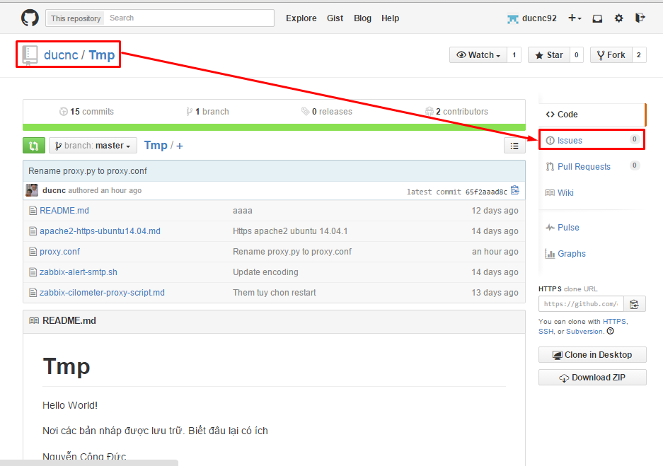
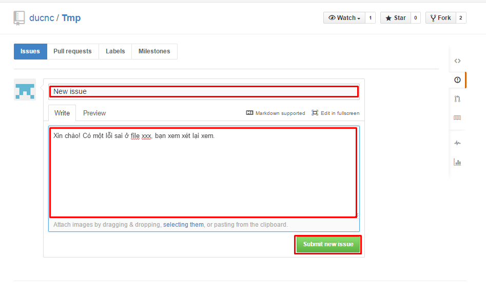
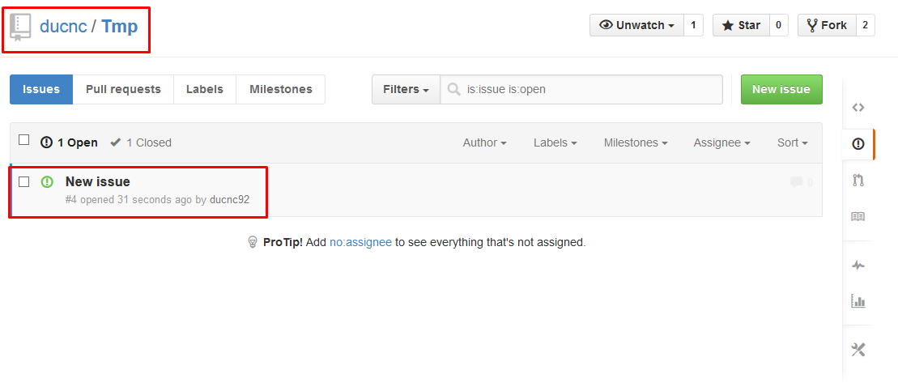
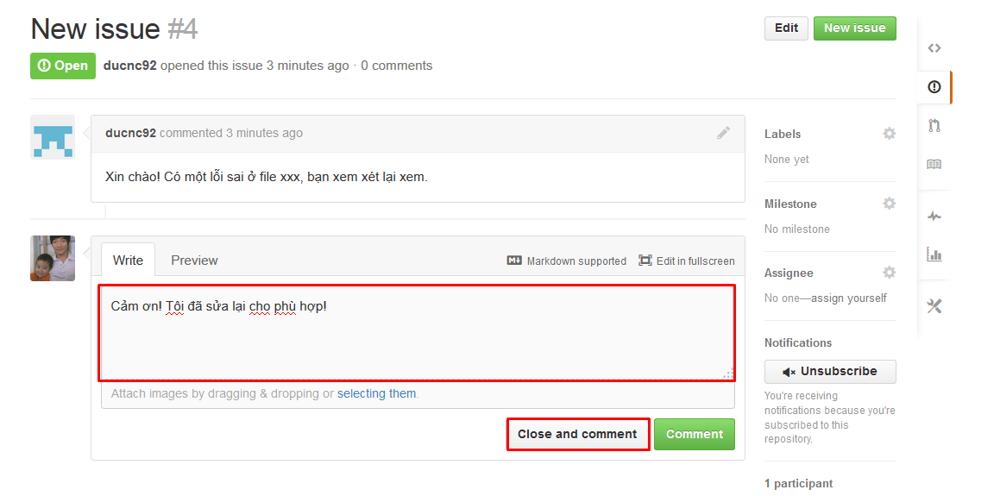

### 5. Issues

Giả sử bạn đang theo dõi repo của tôi và thấy có một số chỗ cần sửa đổi, bạn có thể comment ý kiến của mình vào Repo đó. Sau đó người quản trị sẽ xem xét, thay đổi và trả lời bạn.

Để làm việc này bạn cần vào repo đó, click vào `Issue`. Ví dụ như hình sau:

Sau đó chọn `New issue` (màu xanh) để tạo một issue mới.

Lúc này tại Repo của người quản trị sẽ thấy một Issue mới, người quản trị có thể click vào Issue này để xem, sau đó xem xét sửa đổi, comment lại. Khi sửa đổi hoàn tất thì sẽ đóng issue đó lại.

Bằng cách tạo issue, bạn có thể đăng các câu hỏi, thắc mắc của mình cho chủ của repo đó.
