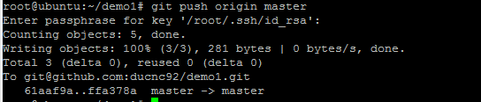
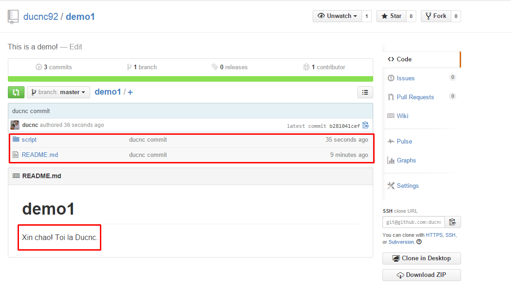

##### 2.1.3. Add, commit, push

Để thực hiện hành động `add` ta sử dụng lệnh sau

> git add README.md
để `add` file README.md

hoặc `git add *` để add tất cả các file hiện có.
 
Để thự hiện hành động commit file README.md ta thực hiện lệnh
> git commit README.md

hoặc `git commit *` để commit tất cả.

ta nên thêm tham số -m để ghi lại một comment cho hành động đó
 
> git commit README.md -m "ducnc sua doi" 

Lúc này các thay đổi của bạn đã được lưu lại trên máy cục bộ. Để đồng bộ lên server Github ta thực hiện lệnh:

> git push origin master

=> nhập passphrase (nếu bạn đặt passphrase ở mục 1.1.) với phương pháp clone ssh hoặc nhập username, password nếu clone bằng https

Lúc này trở lại trang github.com và xem `repo script` lúc đầu sẽ thấy các commit của ta đã được đẩy lên.

Một cách khác nếu bạn không muốn thực hiện clone về máy như bước trên thì bạn có thể làm như sau:

- Tạo một repo mới trên github.com mà không tạo file README.md (giả sử ở đây là repo demo2)

- Tại máy local tạo một thư mục để chứa repo mới này. Ví dụ:

> mkdir /opt/demo2

> cd /opt/demo2

- Thực hiện tạo các file, thư mục như ý muốn. Sau đó thực hiện add, commit, push tương tự như trên
Nhưng ở đây cần thêm lệnh `git remote add origin $git-url` trước khi push. Tham khảo ví dụ sau:

> vi README.md

> git add README.md

> git commit README.md

hoặc `git commit README.md -m noi dung`

> git remote add origin git@github.com:ducnc92/demo2.git

> git push origin master

Sau đó nhập passphrase(nếu cần) hoặc username + password (nếu sử dụng SSH)
