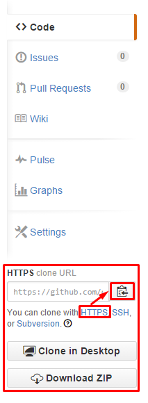

##### 2.1.2. Clone

Clone repo đó về bằng một trong các cách sau:

**Linux**

***SSH:***
`git clone git@github.com:ducnc92/demo1.git`

hoặc: `git clone git@github.com:ducnc92/demo1.git /opt/demo` để clone vào thư mục /opt/demo

đối với phương pháp này các bạn cần nhập passphrase của ~/.ssh/id_rsa (có thể không cần nếu bạn không đặt passphrase)

***HTTPS:***
`git clone https://github.com/ducnc92/demo1.git`

hoặc: `git clone https://github.com/ducnc92/demo1.git /opt/demo` để clone vào thư mục /opt/demo

Để lấy các link SSH, HTTPS này ta làm như sau: Click vào các hyperlink HTTPS hoặc SSH rồi click Copy to clipboard.



Ở đây tôi sử dụng lệnh `git clone git@github.com:ducnc92/demo1.git`

Lúc này trong thư mục hiện tại sẽ có thêm thư mục demo1 chứa các file trong repo trên github.

Chuyển vào thư mục này:

> cd demo1/

> ls

Lúc này sẽ thấy trong thư mục này có file `README.md`. Để sửa file này ta có thể sử dụng bất cứ trình soạn thảo nào, chẳng hạn vi, nano, gedit,...
 
> vi README.md

Thêm vào nội dung như sau:

```
Xin chao!
Toi la Ducnc.
```

Tạo một thư mục mới, chẳng hạn tên là script để chứa các script của tôi.

> mkdir script

Tạo một script mới trong thư mục đó.

> vi script/script1.sh

```sh
#!/bin/sh
echo "Hello Python Vietnam"
sleep 10
```

bằng cách tương tự các bạn có thể tạo thêm nhiều thư mục, file hướng dẫn, cấu hình, script,... tùy ý
