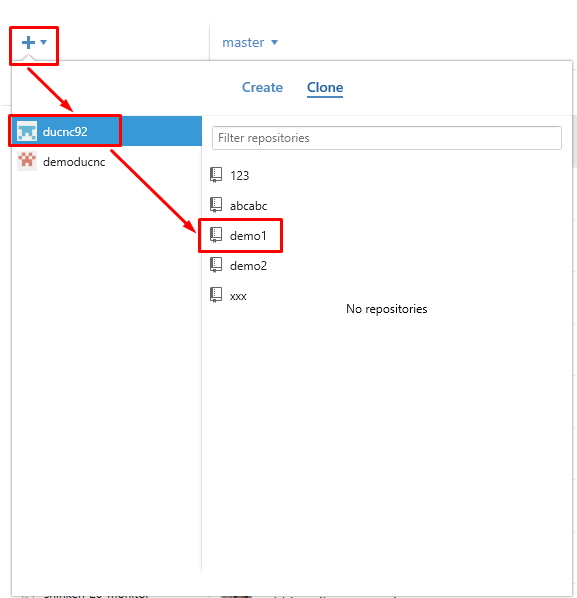
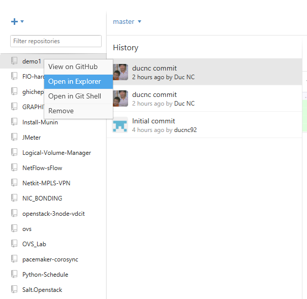

##### 2.2.2. Clone

Click vào dấu cộng, chọn tab Clone, lựa chọn tổ chức mong muốn và chọn repo cần clone

Để chỉnh sửa nội dung của repo này ta chọn chuột phải vào nó và chọn `Open in Explorer`

Lúc đó chương trình Windows Explorer sẽ mở ra thư mục chứa repo của github, bạn có thể chỉnh sửa các file trong này, tạo xóa thư mục,... một cách bình thường.