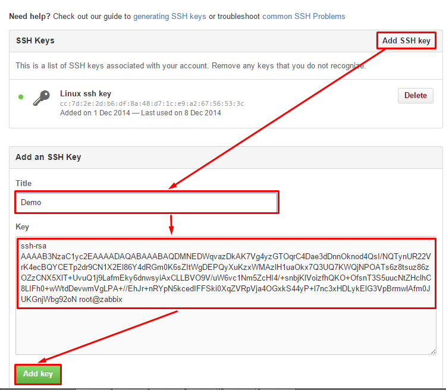

#### 1.1. Linux

Với OS là Ubuntu:

> apt-get install git
	
Với OS là Fedora, Centos

> yum instal git

Các thiết lập ban đầu:

- Bạn cần thiết lập tên và email của mình để mỗi khi commit lên server sẽ nhận biết được ai commit lên vì một repo có thể có nhiều người tham gia.
	
> git config --global user.name "DU HC"

> git config --global user.email hoangcongdu1999s2@gmail.com

- Lựa chọn trình soạn thảo mặc định, có thể là vi, vim, nano,...

> git config --global core.editor vi

- Liệt kê các thiết lập:

> git config --list

**Liên kết với tài khoản github bằng SSH**

> ssh-keygen -t rsa

```sh
Enter file in which to save the key (/root/.ssh/id_rsa): [Press enter]
Enter passphrase (empty for no passphrase): [Press enter]
Enter same passphrase again: [Press enter]
Your identification has been saved in /root/.ssh/id_rsa.
Your public key has been saved in /root/.ssh/id_rsa.pub.
```

Nếu bạn nhập passphrase thì hãy nhớ pass này!

Kết quả:
> ls ~/.ssh/

```sh
id_rsa       id_rsa.pub   known_hosts
```

> ssh-agent -s

> ssh-add ~/.ssh/id_rsa

> cat ~/.ssh/id_rsa.pub

copy đoạn mã này

Truy cập đường dẫn sau https://github.com/settings/ssh (đảm bảo bạn đã đăng nhập vào github), chọn Add SSH key, đặt tên cho key này tại `Title` và paste nội dung vừa copy vào ô `Key`



Lúc này bạn đã có thể commit lên github tại máy local mà không cần nhập username và password.