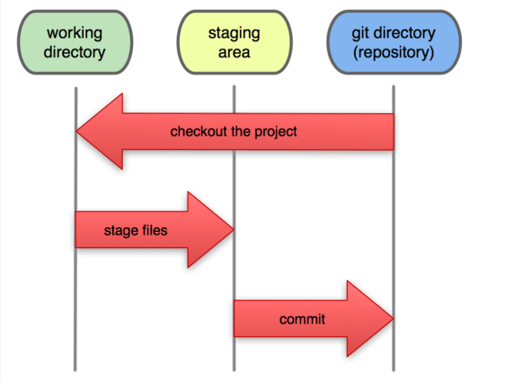

### 0. Repo

Git là một công cụ để quản lý mã nguồn, nhưng tôi không phải là một coder nên tôi sẽ không sử dụng Git theo cách mà các coder hay sử dụng.
Tôi sử dụng git và github để lưu trữ các file cấu hình của mình, các script, viết các bài hướng dẫn, các bản nháp,...
Các repo là những nơi tôi phân loại, lưu trữ những thứ bên trên và nó được lưu cả ở máy trạm và ở server github.
Để làm việc với repo thì bạn phải hiểu về nó. Một số điều bạn cần biết là: 

**Ba trạng thái của một repo:**

Như hình trên bạn có thể thấy có 3 điểm cần lưu ý:

- Working dir: đây là nơi bạn thực hiện các thao tác chỉnh sửa với file mã nguồn của mình, nó có thể là eclipse, netbean, notepad++,...

- Stagging area: những sự thay đổi của bạn với file mã nguồn được lưu lại, giống như bạn ấn Save trong một file notepad.

- Git directory: nơi lưu trữ mã nguồn của bạn (ở đây là github)

Tương ứng với 3 vị trí này ta có các hành động:

- Add: lưu file thay đổi (mang tính cục bộ) - tương ứng với câu lệnh `git add`

- Commit: Ghi lại trạng thái thay đổi tại máy local (ví dụ như bạn có thể ấn Save nhiều lần với file README.md nhưng chỉ khi commit thì trạng thái của lần ấn Save cuối cùng trước đó mới được lưu lại) - tương ứng với câu lệnh `git commit`

- Push: Đẩy những thay đổi từ máy trạm lên server - tương đương lệnh `git push`

- Pull: đồng bộ trạng thái từ server về máy trạm - tương đương lệnh `git pull`