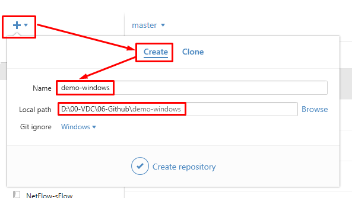
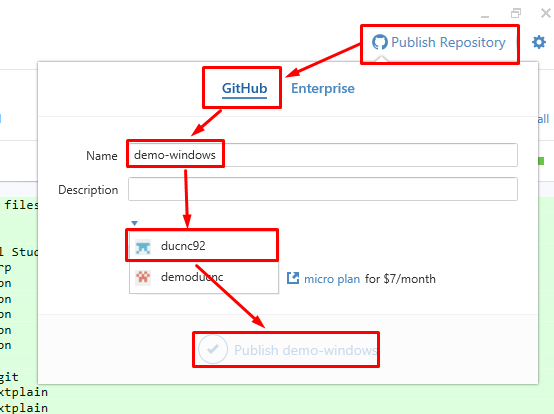

##### 2.2.1. Tạo một repo mới

Tạo repo trên github.com tự như mục 2.1.1.

Tạo repo bằng phần mềm Github

- Click vào dấu cộng, chọn tab Create, đặt tên và chọn đường dẫn cho repo mới

- Tuy nhiên repo mới sinh ra mới chỉ có ở máy trạm, tại mục `Other`. Chọn chuột phải vào repo đó và chọn `Open in Explorer` để sửa nội dung của repo này.

- Sau khi chỉnh sửa xong, để đẩy repo đó lên github.com ta click vào `Publish this repository` và thực hiện như hình sau. Chú ý cần chọn Organization đặt repo này.

