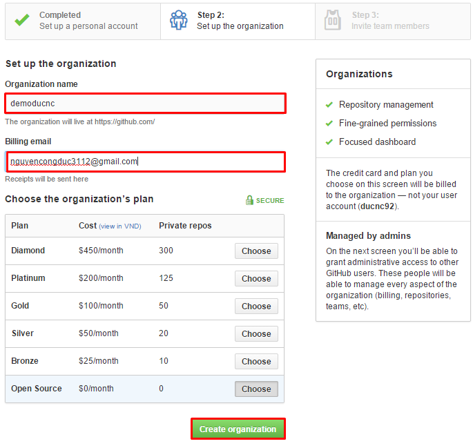
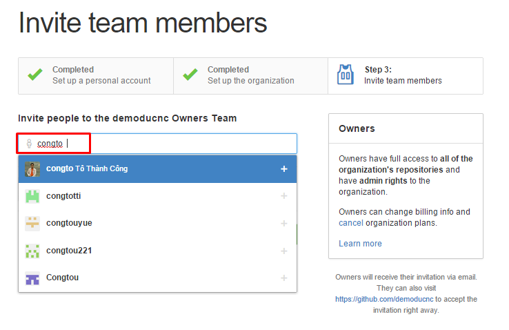
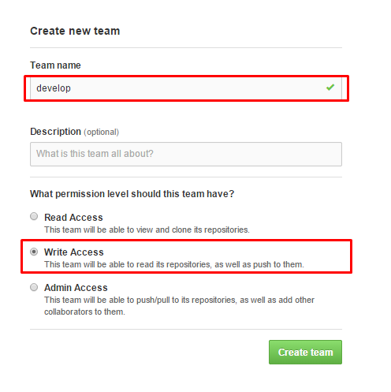
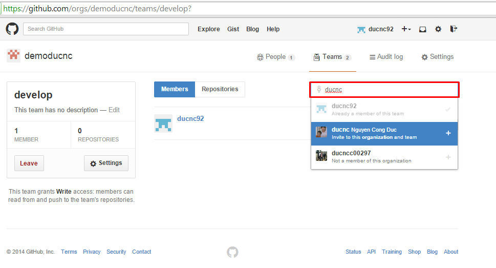

### 3. Thao tác với tổ chức trong Github

Để tạo một nhóm cho nhiều người cùng làm việc ta làm như sau:

- Truy cập URL: https://github.com/settings/organizations, chọn New Organizations

- Đặt tên và email cho tổ chức

Tại mục `Choose the organization’s plan` chọn Open Source để miễn phí, nhưng lúc này các Repo trong tổ chức sẽ là public.

- Mời các thành viên cho tổ chức

Lúc này vào trang cá nhân của bạn sẽ thấy tại mục Organizations có tổ chức mới vừa tạo. Để cấu hình tổ chức này ta click thẳng vào nó.

Ở đây tôi sẽ tạo một team mới như hình sau:

Các member của team này có quyền write với các repo của team.

Với 3 mức: Read Access, Write Access, Admin Access Github cho phép chúng ta phân quyền tới các thành viên của nhóm.

Để mời một người dùng khác vào team, ta click vào team đó và search tên của người dùng cần tìm

Sau đó hệ thống sẽ yêu cầu bạn nhập password để xác thực, nếu thành công, một email xác nhận sẽ được gửi đến người được mời và người này sẽ xác nhận có tham gia vào tổ chức hay không.

Để tạo một repo cho tổ chức, ta chỉ cần click vào tổ chức đó, sau đó chọn `Create new Repostory`. Các hành động clone, add, commit,... làm như bình thường.
