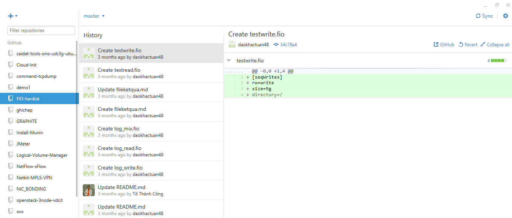

#### 1.2. Windows	

Download tại địa chỉ: https://windows.github.com/

Cài đặt bình thường, yêu cầu phải có .NET 4.5

Giao diện của chương trình:

Thêm tài khoản Github:

- Click vào tool and options (hình bánh răng cạnh biểu tượng Sync) chọn options, Add account. Khai báo username và password trên github.

- Tại mục Configure git thêm Tên và email của mình

Click Update

