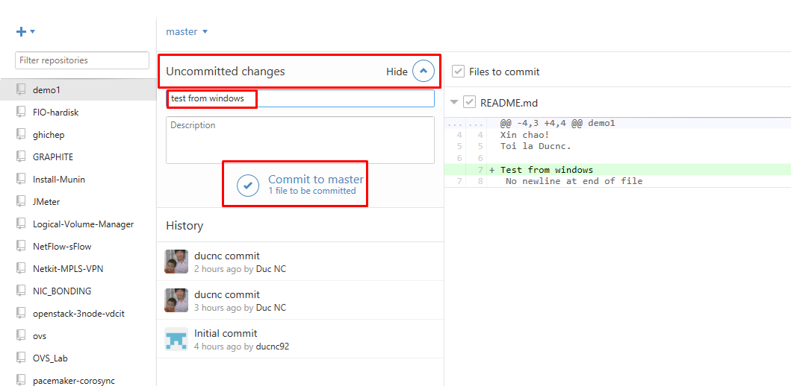

##### 2.2.3. Add, commit, push, pull 

Trở lại với chương trình Github ta sẽ thấy dòng `uncommited changes` tại repo ta vừa sửa. Bạn hãy điền vào đó comment và ấn `commit to master`

Lúc này sự thay đổi của bạn với mã nguồn đã được ghi lại trên máy local, để đồng bộ nó lên server github bạn hãy ấn vào biểu tượng `Sync` ở góc trên cùng bên phải.

Sau khi đồng bộ xong, quay trở lại repo trên trang github.com.

Để đồng bộ những thay đổi trên github.com về máy local (pull) ta cũng click vào biểu tượng `Sync` như bên trên.
